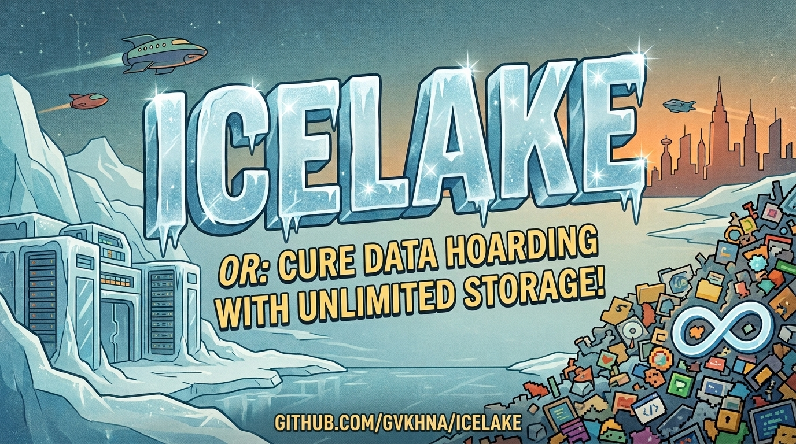

<p align="center">
  
</p>

<h1 align="center">icelake</h1>

<p align="center">
  <a href="https://github.com/gvkhna/icelake/actions/workflows/ci.yml"></a>
  <a href="https://github.com/gvkhna/icelake/releases"></a>
  <a href="https://github.com/gvkhna/icelake/attestations"></a>
  <a href="https://pkg.go.dev/github.com/gvkhna/icelake"></a>
  <a href="https://goreportcard.com/report/github.com/gvkhna/icelake"></a>
  <a href="LICENSE"></a>
</p>

<p align="center">
  Stream records into Apache Iceberg tables on your own object storage.<br>
  A Go library and a small CLI. No server.
</p>

## Purpose

icelake turns a stream of records into queryable [Apache Iceberg](https://iceberg.apache.org/) tables: ZSTD-compressed Parquet files in a bucket you own (Cloudflare R2, or anything with an S3 API). You keep full history at object-storage prices, and you query it with standard tools instead of an icelake API.

The architecture is the two formats doing what they were built for. Records are batched and written as Parquet files, the columnar format every query engine reads. Iceberg is the table layer on top: metadata in the same bucket that says which files make up each table, what the schema is, and how it has evolved. Together they make a plain bucket behave like a database's tables, except the storage is cheap, the files are open formats, and any engine can query them in place. icelake owns the write path; the read path is whatever tool you already use.

There is no service to deploy and no account to create; the library talks straight to your bucket.

What it gives you:

- Ingest from any language: pipe JSON lines or CBOR into the `icelake` command, or embed the Go library. Both paths run the same code.
- Every accepted record lands in a local SQLite staging file before anything else. Kill the process at any point; the next start commits what was accepted, exactly once.
- Local-only mode needs no bucket at all. Point the same data directory at a bucket later and the backlog uploads and commits itself, in order.
- Reads go through standard tools: DuckDB, PyIceberg, Spark, anything that understands Iceberg or Parquet. icelake is not on the read path.
- An optional ClickHouse mirror inserts each flushed batch into a ClickHouse server as it is written to the lake. Build materialized views on it for fast indexed queries, give raw rows a TTL, and treat the mirror as disposable: the bucket stays the source of truth and can rebuild it. Recent data sits hot in ClickHouse, full history cold in the bucket.

## Usage

### Install

With [mise](https://mise.jdx.dev) (verifies the signed build attestation on install):

```sh
mise use -g github:gvkhna/icelake
```

Or grab an archive from the [releases page](https://github.com/gvkhna/icelake/releases): linux and macOS, amd64 and arm64, each a single static binary. Or build from a clone: `go build -o icelake ./cmd/icelake`. There is no `go install` route; released binaries are the supported path.

For Go programs, install the library instead:

```sh
go get github.com/gvkhna/icelake
```

### Pipe records in

Declare your tables once, in a JSON schema document. The document declares shape only: names, types, field ids.

```json
{"tables": [
  {"namespace": "market", "table": "fills", "fields": [
    {"name": "symbol", "type": "string",        "fieldid": 1},
    {"name": "price",  "type": "decimal(18,9)", "fieldid": 2},
    {"name": "ts_ms",  "type": "timestamptz",   "fieldid": 3}
  ]}
]}
```

Then point the daemon at it and pipe records to stdin, one JSON object per line:

```sh
export ICELAKE_DATA_DIR=/var/lib/icelake
export ICELAKE_SCHEMA_FILE=/etc/icelake/schema.json
export ICELAKE_LOCAL_ONLY=true   # no bucket needed to try it

your-producer | icelake run
# {"table":"market.fills","row":{"symbol":"ABC","price":"1.234567890","ts_ms":1700000000000}}
```

A record can also be a CBOR map, and one pipe can carry both encodings interleaved. There is no format setting: each record's first byte says what it is. CBOR is smaller on the wire, keeps big integers exact, and carries binary columns without base64.

To write to a bucket, drop `ICELAKE_LOCAL_ONLY` and set the connection instead:

```sh
export ICELAKE_ENDPOINT=https://<account>.r2.cloudflarestorage.com
export ICELAKE_BUCKET=my-bucket
export ICELAKE_PREFIX=warehouse
export ICELAKE_ACCESS_KEY_ID=...
export ICELAKE_SECRET_ACCESS_KEY=...
```

The prefix is required: everything icelake writes stays under that path, so one bucket can hold several icelake collections (and anything else) side by side, each under its own prefix.

By default `icelake run` puts itself in the background like a standard daemon: it validates everything on your terminal first, then detaches, writes and locks a pid file, and logs to `<data dir>/icelake.log`. Add `-f` to keep it in the foreground, logging to stderr. Stop it with `kill $(cat <data dir>/icelake.pid)`; the pipe keeps feeding it either way.

Everything written while local-only uploads and commits on the next start. `icelake usage` prints the full manual: every environment variable, the schema document format, record encodings, crash and backpressure behavior, and the daemon modes.

### Embed the library

The same pipeline, typed, in your own program:

```go
type Fill struct {
    Symbol string `parquet:"name=symbol, logical=String, fieldid=1" arrow:"symbol"`
    Price  int64  `parquet:"name=price, logical=decimal, precision=18, scale=9, fieldid=2" arrow:"price"`
    TsMS   int64  `parquet:"name=ts_ms, logical=timestamp, logical.unit=millis, logical.isadjustedutc=true, fieldid=3" arrow:"ts_ms"`
}

store, err := icelake.Open(ctx, icelake.Config{
    StagingPath:     "/var/lib/myservice/staging.db",
    CatalogPath:     "/var/lib/myservice/catalog.db",
    Endpoint:        "https://<account>.r2.cloudflarestorage.com",
    Bucket:          "my-bucket",
    WarehousePrefix: "warehouse",
    AccessKeyID:     os.Getenv("R2_ACCESS_KEY_ID"),
    SecretAccessKey: os.Getenv("R2_SECRET_ACCESS_KEY"),
})
// ...
fills, err := icelake.OpenWriter(ctx, store, icelake.TableConfig[Fill]{
    Namespace: "myservice",
    Table:     "fills",
})
// Insert returns once the record is durably staged. Batching, Parquet
// encoding, upload and the Iceberg commit happen in the background.
err = fills.Insert(ctx, Fill{Symbol: "ABC", Price: 1_234_567_890, TsMS: time.Now().UnixMilli()})
```

Use `InsertBatch` for throughput (one disk sync per batch instead of per record), `OpenDynamicWriter` to declare tables from a schema document at runtime, and `IngestStream` to run the whole stdin loop the CLI runs. The [compiled example](example_test.go) runs in CI against a real object store, so it cannot drift. Full API docs are on [pkg.go.dev](https://pkg.go.dev/github.com/gvkhna/icelake).

### Query it back

DuckDB, straight off the bucket:

```sql
INSTALL iceberg; INSTALL httpfs;
SET unsafe_enable_version_guessing = true;
SELECT count(*) FROM iceberg_scan('s3://my-bucket/warehouse/market/fills');
```

If you set `ICELAKE_CACHE_DIR` (or `Config.CacheDir`), every uploaded Parquet file is also kept on local disk with its own retention, and `read_parquet()` works on that directory with no network at all.

### Mirror into ClickHouse

Set the mirror and every flushed batch is inserted into ClickHouse in the same step that writes it to the lake:

```sh
export ICELAKE_CLICKHOUSE_ADDR=localhost:9000
export ICELAKE_CLICKHOUSE_TTL="market.fills=720h@ts_ms"   # optional row expiry per table
```

icelake creates one ClickHouse table per lake table and delivers rows; materialized views, aggregations and sorting keys are yours to build on top. A ClickHouse server that is down never blocks or loses lake data. Raw rows past their TTL expire on the server while the lake keeps everything.

## Development

The toolchain is pinned with [mise](https://mise.jdx.dev):

```sh
git clone https://github.com/gvkhna/icelake && cd icelake
mise install                      # Go, linters, everything pinned in mise.toml
GOFLAGS=-count=1 mise run check   # fmt, build, test -race, vet, lint, tidy, codegen checks
```

The test suite runs end to end against real substrates: MinIO and ClickHouse in containers (rootless Podman or Docker), DuckDB as an independent read-back validator. There are no mocks of the storage layer.

Layout:

- repo root: the public library module, `github.com/gvkhna/icelake`
- `cmd/`: the binaries (`icelake`, `icelake-rebuild`, `icelake-r2check`), each a thin wrapper over a library call
- `internal/`: the implementation, plus the end-to-end scenario suite in `internal/e2e`
- `docs/`: design docs and decision records: [ARCHITECTURE](docs/ARCHITECTURE.md), [SCHEMA](docs/SCHEMA.md), [TESTING](docs/TESTING.md), [PLAN](docs/PLAN.md), [RELEASING](docs/RELEASING.md)
- [AGENTS.md](AGENTS.md): the binding rules for working in this repo, for humans and agents

Releases are cut by pushing a version tag; CI builds the archives and signs [build provenance attestations](https://github.com/gvkhna/icelake/attestations) for them, and published releases are immutable.

## License

[MIT](LICENSE)
